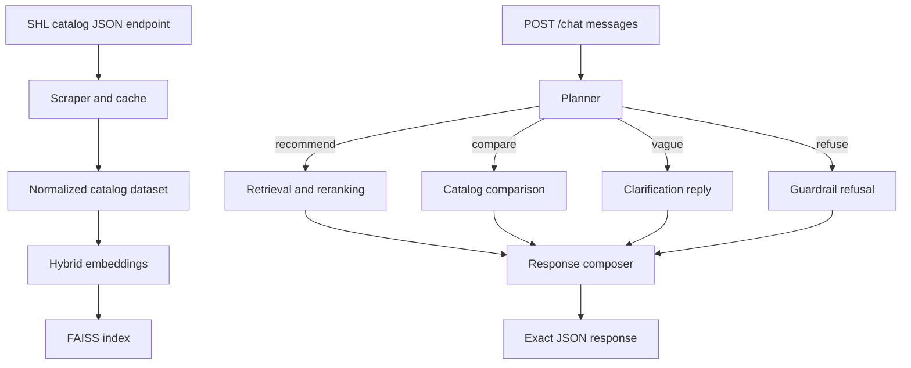

# Architecture

## Notes

- The service is stateless; every request carries the full transcript.
- The catalog JSON endpoint is the primary source of truth.
- The public website is a fallback path only if the endpoint is unavailable.
- Recommendations are limited to catalog items that look like individual assessments, not reports or packaged solutions.
